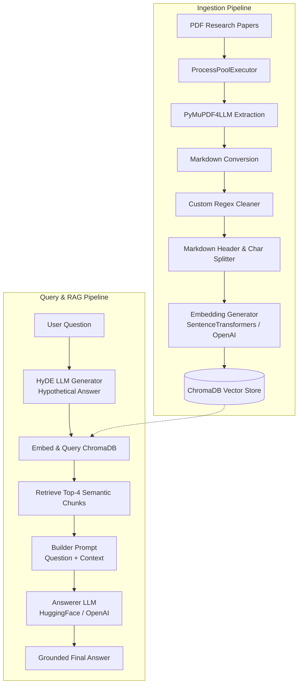

# 🏆 GroundedQA: Intelligent PDF & Research Paper RAG Engine

GroundedQA is a high-performance Retrieval-Augmented Generation (RAG) system engineered specifically to ingest, process, index, and answer complex questions grounded entirely in academic research papers, technical manuals, and PDF documentation. 

Built with scalability, efficiency, and flexibility in mind, GroundedQA supports dual-mode execution—letting you run entirely **offline and local** (via SentenceTransformers and Hugging Face Hub) or **cloud-optimized** (via OpenAI embeddings and GPT-4o models).

---

## 🗺️ System Architecture & Workflow

The architecture is divided into two highly optimized pipelines:
1. **Concurrent Document Ingestion Pipeline**: Parsed documents are cleaned, split semantically, embedded, and indexed.
2. **HyDE-Powered Grounded Q&A Pipeline**: High-relevance search is achieved using Hypothetical Document Embeddings (HyDE) before grounding the final answers using context.



---

## ✨ Core Features

* 🚀 **Multi-Document Upload**: Directly drag-and-drop or upload multiple PDFs / research papers in a unified Gradio web dashboard.
* ⚡ **High-Throughput Concurrent Processing**: Uses Python's `ProcessPoolExecutor` to process and parse multiple documents in parallel, making full use of available CPU cores.
* 🧹 **Intellectual Markdown Cleaning**: Employs structural regex filters to automatically strip out tables, image placeholders, and raw picture-text blocks, leaving only pure, meaningful semantic text.
* 📐 **Semantic Multi-Stage Chunking**: Uses LangChain's `MarkdownHeaderTextSplitter` followed by `RecursiveCharacterTextSplitter` to retain document structure (headers, subheaders) and maintain consistent chunk sizes (1000 characters with 200-character overlap).
* 🔮 **HyDE (Hypothetical Document Embeddings)**: Significantly increases vector retrieval accuracy by using an LLM to generate a hypothetical factual answer to the query, which is embedded to pull context from ChromaDB rather than using the raw query.
* 🧠 **Flexible Dual Embedding & Generation Modes**:
  * **Local / DEV Mode**: Completely offline vector embeddings using `all-MiniLM-L6-v2` (`SentenceTransformers`) and generation via open-source state-of-the-art models (e.g., `Llama-3.1-8B-Instruct`) hosted on Hugging Face Inference API.
  * **Cloud / PROD Mode**: Commercial-grade precision using OpenAI's `text-embedding-3-small` and generation using models like `gpt-4o`.
* 🎨 **Interactive Gradio Dashboard**: Clean UI designed to upload, index, query, and render markdown-formatted grounded answers with easy-to-understand examples.

---

## ⚙️ Technical Tech Stack

| Component | Tooling & Models |
| :--- | :--- |
| **Frontend UI** | [Gradio](https://gradio.app/) |
| **PDF Extraction** | [PyMuPDF4LLM](https://github.com/pymupdf/PyMuPDF4LLM) |
| **Document Chunking** | [LangChain Splitters](https://github.com/langchain-ai/langchain) |
| **Vector Database** | [ChromaDB](https://www.trychroma.com/) (Local client) |
| **Local Model Suite** | `SentenceTransformers` (`all-MiniLM-L6-v2`) & `Hugging Face InferenceClient` |
| **Cloud Model Suite** | OpenAI (`text-embedding-3-small`, `gpt-4o`) |
| **Environment Control**| `python-dotenv` & `uv` package manager |

---

## 🔧 Installation & Setup Guide

### 1. Clone the Repository
```bash
git clone https://github.com/ayushjaswal/scienceqa-project.git
cd scienceqa-project
```

### 2. Install Dependencies (Using `uv`)
We recommend using the extremely fast Python package manager [uv](https://github.com/astral-sh/uv).
```bash
# Initialize project environment
uv init

# Install requirements
uv add -r requirement.txt

# Synchronize virtual environment
uv sync
```

### 3. Configure the Environment
Create a `.env` file in the root directory. You can copy the contents of `.env.sample` and fill in your API keys and preferred configurations:

---

## 🚀 How to Run GroundedQA

To boot up the interactive Gradio dashboard locally:

```bash
# Run using uv
uv run app.py

# Or run directly via your virtual environment python
python app.py
```

Once executed, open your browser and navigate to the local host URL (typically `http://127.0.0.1:7860`):

1. **Upload Documents**: Under the "Upload Documents" column, drag-and-drop your research papers or academic PDFs.
2. **Index**: Click **Index Documents**. This triggers concurrent PDF-to-Markdown parsing, custom cleaning, and vector storage indexing in ChromaDB.
3. **Query**: Ask any technical question. GroundedQA will synthesize a hypothetical response, search for top-4 highly similar document segments, and output a premium, grounded answer with clear real-world examples!

---

## 📝 Grounded QA Prompting Philosophy

The system's `Answerer` ensures strict factual alignment:
* **No hallucination**: If the vector database fails to retrieve matching content, the LLM will reply strictly with: `"There's no information regarding that in the KB"`.
* **Structured & Educational**: Outputs are enriched with rich markdown syntax and include simplified examples to make dense research paper content accessible.